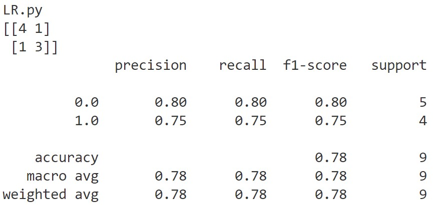
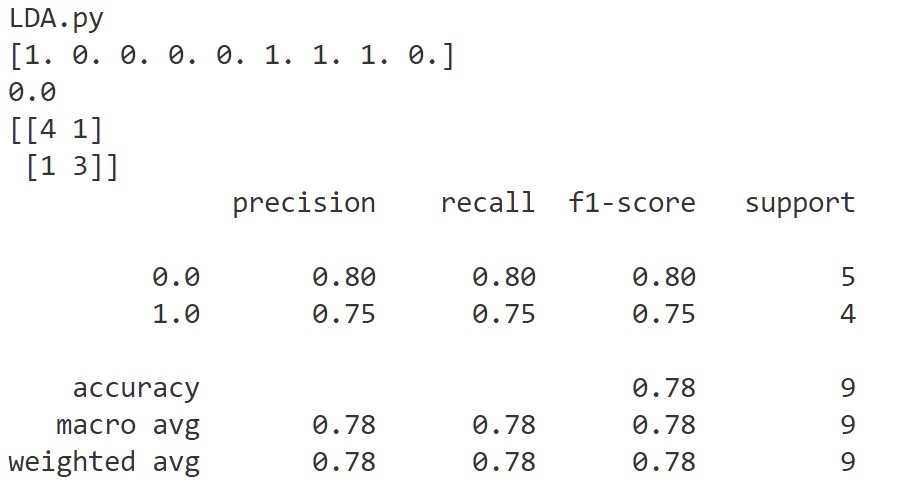

###第三章作业
####课后习题
#####3.1 
1. 对于二分类问题，不同类别之间的分界线过原点时。
2. 当两个线性模型相减时，消除了b。例如可用训练集中每个样本都减去第一个样本，然后对新的样本做线性回归，不用考虑偏置项b。

#####3.3
调用sklearn求解
```
import numpy as np
import matplotlib.pyplot as plt

# load the CSV file as a numpy matrix
dataSet = np.loadtxt('D:\\vscode\Markdown\ML\watermelon_3a.csv', delimiter = ",")

# separate the data from the target attributes
X = dataSet[:, 1:3]
y = dataSet[:, 3]

# draw scatter diagram to show the raw data
f1 = plt.figure(1)
plt.title('watermelon_3a')  
plt.xlabel('density')  
plt.ylabel('ratio_sugar')

plt.scatter(X[y == 0,0], X[y == 0,1], marker = 'o', color = 'k', s=100, label = 'bad')

plt.scatter(X[y == 1,0], X[y == 1,1], marker = 'o', color = 'g', s=100, label = 'good')
plt.legend(loc = 'upper right')  
plt.show()


''' 
using sklearn lib for logistic regression
'''
from sklearn import model_selection
from sklearn.linear_model import LogisticRegression
from sklearn import metrics


# generalization of test and train set
X_train, X_test, y_train, y_test = model_selection.train_test_split(X, y, test_size=0.5, random_state=0)

# model training
log_model = LogisticRegression() 
log_model.fit(X_train, y_train) 

# model testing
y_pred = log_model.predict(X_test)

# summarize the accuracy of fitting
print(metrics.confusion_matrix(y_test, y_pred))
print(metrics.classification_report(y_test, y_pred))
```
函数实现对数几率回归
```
import numpy as np
import pandas as pd
from matplotlib import pyplot as plt
from sklearn import linear_model

def sigmoid(x):
    s = 1 / (1 + np.exp(-x))
    return s

def J_cost(X, y, beta):
    '''
    :param X:  sample array, shape(n_samples, n_features)
    :param y: array-like, shape (n_samples,)
    :param beta: the beta in formula 3.27 , shape(n_features + 1, ) or (n_features + 1, 1)
    :return: the result of formula 3.27
    '''
    X_hat = np.c_[X, np.ones((X.shape[0], 1))]
    beta = beta.reshape(-1, 1)
    y = y.reshape(-1, 1)

    Lbeta = -y * np.dot(X_hat, beta) + np.log(1 + np.exp(np.dot(X_hat, beta)))

    return Lbeta.sum()

def gradient(X, y, beta):
    '''
    compute the first derivative of J(i.e. formula 3.27) with respect to beta      i.e. formula 3.30
    ----------------------------------
    :param X: sample array, shape(n_samples, n_features)
    :param y: array-like, shape (n_samples,)
    :param beta: the beta in formula 3.27 , shape(n_features + 1, ) or (n_features + 1, 1)
    :return:
    '''
    X_hat = np.c_[X, np.ones((X.shape[0], 1))]
    beta = beta.reshape(-1, 1)
    y = y.reshape(-1, 1)
    p1 = sigmoid(np.dot(X_hat, beta))

    gra = (-X_hat * (y - p1)).sum(0)

    return gra.reshape(-1, 1)

def hessian(X, y, beta):
    '''
    compute the second derivative of J(i.e. formula 3.27) with respect to beta      i.e. formula 3.31
    ----------------------------------
    :param X: sample array, shape(n_samples, n_features)
    :param y: array-like, shape (n_samples,)
    :param beta: the beta in formula 3.27 , shape(n_features + 1, ) or (n_features + 1, 1)
    :return:
    '''
    X_hat = np.c_[X, np.ones((X.shape[0], 1))]
    beta = beta.reshape(-1, 1)
    y = y.reshape(-1, 1)

    p1 = sigmoid(np.dot(X_hat, beta))

    m, n = X.shape
    P = np.eye(m) * p1 * (1 - p1)

    assert P.shape[0] == P.shape[1]
    return np.dot(np.dot(X_hat.T, P), X_hat)

def update_parameters_gradDesc(X, y, beta, learning_rate, num_iterations, print_cost):
    '''
    update parameters with gradient descent method
    --------------------------------------------
    :param beta:
    :param grad:
    :param learning_rate:
    :return:
    '''
    for i in range(num_iterations):

        grad = gradient(X, y, beta)
        beta = beta - learning_rate * grad

        if (i % 10 == 0) & print_cost:
            print('{}th iteration, cost is {}'.format(i, J_cost(X, y, beta)))
        
    return beta

def update_parameters_newton(X, y, beta, num_iterations, print_cost):
    '''
    update parameters with Newton method
    :param beta:
    :param grad:
    :param hess:
    :return:
    '''

    for i in range(num_iterations):

        grad = gradient(X, y, beta)
        hess = hessian(X, y, beta)
        beta = beta - np.dot(np.linalg.inv(hess), grad)

        if (i % 10 == 0) & print_cost:
            print('{}th iteration, cost is {}'.format(i, J_cost(X, y, beta)))
    return beta

def initialize_beta(n):
    beta = np.random.randn(n + 1, 1) * 0.5 + 1
    return beta

def logistic_model(X, y, num_iterations=100, learning_rate=1.2, print_cost=False, method='gradDesc'):
    '''
    :param X:
    :param y:~
    :param num_iterations:
    :param learning_rate:
    :param print_cost:
    :param method: str 'gradDesc' or 'Newton'
    :return:
    '''
    m, n = X.shape
    beta = initialize_beta(n)

    if method == 'gradDesc':
        return update_parameters_gradDesc(X, y, beta, learning_rate, num_iterations, print_cost)
    elif method == 'Newton':
        return update_parameters_newton(X, y, beta, num_iterations, print_cost)
    else:
        raise ValueError('Unknown solver %s' % method)

def predict(X, beta):
    X_hat = np.c_[X, np.ones((X.shape[0], 1))]
    p1 = sigmoid(np.dot(X_hat, beta))

    p1[p1 >= 0.5] = 1
    p1[p1 < 0.5] = 0

    return p1

# load the CSV file as a numpy matrix
dataSet = np.loadtxt('D:\\vscode\Markdown\ML\watermelon_3a.csv', delimiter = ",")

# separate the data from the target attributes
X = dataSet[:, 1:3]
y = dataSet[:, 3]

from sklearn import model_selection
from sklearn import metrics

# generalization of test and train set
X_train, X_test, y_train, y_test = model_selection.train_test_split(X, y, test_size=0.5, random_state=0)

# model training
beta = logistic_model(X_train, y_train)

# model testing
y_pred = predict(X_test, beta)

# summarize the accuracy of fitting
print(metrics.confusion_matrix(y_test, y_pred))
print(metrics.classification_report(y_test, y_pred))
```
结果为：


#####3.4
留一法，调用sklearn和函数实现
错误率为0.2312
```
import numpy as np
from sklearn import linear_model
from sklearn.model_selection import LeaveOneOut

data = np.loadtxt('D:\\vscode\Markdown\ML\Transfusion.txt', delimiter=',').astype(int)

X = data[:, : 4]
y = data[:, 4]
m, n = X.shape

# normalization
X = (X - X.mean(0)) / X.std(0)

# shuffle
index = np.arange(m)
np.random.shuffle(index)

X = X[index]
y = y[index]

# LOO
lr = linear_model.LogisticRegression(C = 2)

loo = LeaveOneOut()
accuracy = 0
for train, test in loo.split(X, y):
    lr_ = linear_model.LogisticRegression(C = 2)
    X_train = X[train]
    X_test = X[test]
    y_train = y[train]
    y_test = y[test]
    lr_.fit(X_train, y_train)

    accuracy += lr_.score(X_test, y_test)

print(1 - accuracy / m)

# LOO self
score_myLoo = []
for i in range(m):
    lr_ = linear_model.LogisticRegression(C = 2)
    X_test = X[i, :]
    y_test = y[i]

    X_train = np.delete(X, i, axis = 0)
    y_train = np.delete(y, i, axis = 0)

    lr_.fit(X_train, y_train)

    score_myLoo.append(int(lr_.predict(X_test.reshape(1, -1))) == y_test)

print(1 - np.mean(score_myLoo))
```
10折交叉验证法，调用sklearn和函数实现
错误率为0.2299
```
import numpy as np
from sklearn import linear_model
from sklearn.model_selection import cross_val_score

data = np.loadtxt('D:\\vscode\Markdown\ML\Transfusion.txt', delimiter=',').astype(int)

X = data[:, : 4]
y = data[:, 4]
m, n = X.shape

# normalization
X = (X - X.mean(0)) / X.std(0)

# shuffle
index = np.arange(m)
np.random.shuffle(index)

X = X[index]
y = y[index]

# 10 cross validation
lr = linear_model.LogisticRegression(C = 2)
score = cross_val_score(lr, X, y, cv = 10)
print(1 - score.mean())


# 10 cross self
num_split = int(m / 10)
myScore = []
for i in range(10):
    lr = linear_model.LogisticRegression(C = 2)

    test_index = range(i * num_split, (i + 1) * num_split)
    X_test_ = X[test_index]
    y_test_ = y[test_index]

    X_train_ = np.delete(X, test_index, axis=0)
    y_train_ = np.delete(y, test_index, axis=0)

    lr.fit(X_train_, y_train_)
    myScore.append(lr.score(X_test_, y_test_))

print(1 - np.mean(myScore))
```
两种方法的错误率相差很小

#####3.5
```
import numpy as np
from sklearn.discriminant_analysis import LinearDiscriminantAnalysis as LDA
from sklearn import model_selection
from sklearn import metrics

# load the CSV file as a numpy matrix
dataSet = np.loadtxt('D:\\vscode\Markdown\ML\watermelon_3a.csv', delimiter = ",")

# separate the data from the target attributes
X = dataSet[:, 1:3]
y = dataSet[:, 3]

# generalization of test and train set
X_train, X_test, y_train, y_test = model_selection.train_test_split(X, y, test_size=0.5, random_state=0)

# model training
clf = LDA()
clf.fit(X_train, y_train)

# model testing
y_pred = clf.predict(X_test)
print(y_pred)
print(1 - clf.score(X_train, y_train))

# summarize the accuracy of fitting
print(metrics.confusion_matrix(y_test, y_pred))
print(metrics.classification_report(y_test, y_pred))
```
结果为：


#####3.9
对 OvR 、 MvM 来说，由于对每个类进行了相同的处理，其拆解出的二分类任务中类别不平衡的影响会相互抵消，因此通常不需专门处理。
