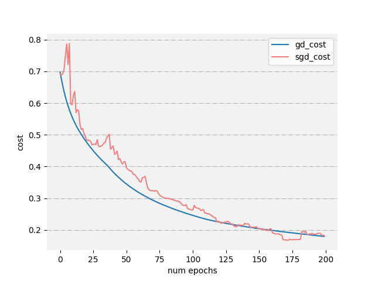

###第五章作业
####课后习题
*5.1 试述将线性函数$f(x) = w^Tx$用作神经元激活函数的缺陷*
使用线性函数作为激活函数时，无论是在隐藏层还是在输出层，其单元值都还是输入的线性组合,**等价于线性回归，而纯粹的线性组合并不能够解决更为复杂的问题**
引入激活函数之后，因为激活函数都是非线性的，也会给神经元引入非线性元素，使得神经网络可以逼近其他的任何非线性函数，这样可以使得神经网络应用到更多非线性模型中

*5.2 试述使用图5.2(b)激活函数的神经元与对率回归的联系*
每个神经元的作用几乎和对率回归相同
但是**对率回归输出sigmoid(x)映射后的离散值，而神经元直接输出sigmoid(x)的值**

*5.3 对于图 5.7 中的 $v_{ih}$，试推导出 BP 算法中的更新公式 (5.13)*
$\Delta v_{ih} = -\eta \times \frac{\partial E_k}{\partial \alpha_h} \times \frac{\partial \alpha_h}{\partial v_{ih}}$
$e_h = -\frac{\partial E_k}{\partial \alpha_h} = -\frac{\partial E_k}{\partial b_h} \times \frac{\partial b_h}{\partial \alpha_h} = -\sum_{j = 1}^l \frac{\partial E_k}{\partial \beta_j} \frac{\partial \beta_j}{\partial b_h} \frac{\partial b_h}{\partial \alpha_h} = \sum_{j = 1}^l g_i w_{hj}f'(\alpha_h - \gamma_h) = b_h(1 - b_h)\sum_{j = 1}^l g_i w_{hj}$
$\frac{\partial \alpha_h}{\partial v_{ih}} = x_i$
$\therefore \Delta v_{ih} = \eta e_h x_i$

*5.4 试述式 (5.6) 中学习率的取值对神经网络训练的影响*
**学习率过低，训练速度慢，影响训练效率
学习率过高，可能会错过全局最优，也可能会导致误差函数来回震荡，无法收敛**

*5.5 试编程实现标准 BP 算法和累积 BP 算法，在西瓜数据集 3.0 上分别用这两个算法训练一个单隐层网络，并进行比较*
代码：
```
import numpy as np
import copy
import pandas as pd
import bpnnUtil

# 基于BP的神经网络
class BpNN(object):

    def __init__(self, layer_dims_, learning_rate=0.1, seed=16, initializer='he', optimizer='gd'):
        
        """
        layer_dims_: 神经网络的每一层的节点数
        initializer: 权值初始化方法
        """    

        self.layer_dims_ = layer_dims_
        self.learning_rate = learning_rate
        self.seed = seed
        self.initializer = initializer
        self.optimizer = optimizer

    # 调试参数
    def fit(self, X_, y_, num_epochs=100):
        # m: 样本数，n:属性数
        m, n = X_.shape
        layer_dims_ = copy.deepcopy(self.layer_dims_)
        # 增加输入层
        layer_dims_.insert(0, n)

        if y_.ndim == 1:
            y_ = y_.reshape(-1, 1)

        # 初始化每一层的参数
        self.parameters_ = bpnnUtil.he_initializer(layer_dims_, self.seed)

        # 选择优化方案
        assert self.optimizer in ('gd', 'sgd')
        if self.optimizer == 'gd':
            parameters_, costs = self.optimizer_gd(X_, y_, self.parameters_, num_epochs, self.learning_rate)
        elif self.optimizer == 'sgd':
            parameters_, costs = self.optimizer_sgd(X_, y_, self.parameters_, num_epochs, self.learning_rate, self.seed)

        self.parameters_ = parameters_
        self.costs = costs

        return self

    # 计算损失函数
    def compute_cost(self, y_hat_, y_):
        if y_.ndim == 1:
            y_ = y_.reshape(-1, 1)
        if y_.shape[1] == 1:
            cost = bpnnUtil.cross_entry_sigmoid(y_hat_, y_)
        else:
            cost = bpnnUtil.cross_entry_softmax(y_hat_, y_)
        return cost

    # 向后传播一层，计算本层导数值
    def backward_one_layer(self, da_, cache_, activation_):
        
        # 当前层参数值
        (a_pre_, w_, b_, z_) = cache_
        m = da_.shape[0]

        assert activation_ in ('sigmoid', 'relu', 'softmax')

        # 算出本层未激活前函数的导数值
        if activation_ == 'sigmoid':
            dz_ = bpnnUtil.sigmoid_backward(da_, z_)
        elif activation_ == 'relu':
            dz_ = bpnnUtil.relu_backward(da_, z_)
        else:
            dz_ = bpnnUtil.softmax_backward(da_, z_)

        # 计算本层其他参数的导数值
        dw = np.dot(dz_.T, a_pre_) / m
        db = np.sum(dz_, axis=0, keepdims=True) / m
        da_pre = np.dot(dz_, w_)

        assert dw.shape == w_.shape
        assert db.shape == b_.shape
        assert da_pre.shape == a_pre_.shape

        return da_pre, dw, db

    # 向后传播
    def backward_L_layer(self, a_last, y_, caches):

        grads = {}
        L = len(caches)

        if y_.ndim == 1:
            y_ = y_.reshape(-1, 1)

        if y_.shape[1] == 1:  # 目标值只有一列表示为二分类
            # 计算输出错误率对输出值的导数
            da_last = -(y_ / a_last - (1 - y_) / (1 - a_last))
            # 计算输出层参数的导数和隐层输出值的导数
            da_pre_L_1, dwL_, dbL_ = self.backward_one_layer(da_last, caches[L - 1], 'sigmoid')

        else:  # 经过one hot，表示为多分类

            # 在计算softmax的梯度时，可以直接用 dz = a - y可计算出交叉熵损失函数对z的偏导， 所以这里第一个参数输入直接为y_
            da_pre_L_1, dwL_, dbL_ = self.backward_one_layer(y_, caches[L - 1], 'softmax')

        grads['da' + str(L)] = da_pre_L_1
        grads['dW' + str(L)] = dwL_
        grads['db' + str(L)] = dbL_

        for i in range(L - 1, 0, -1):
            da_pre_, dw, db = self.backward_one_layer(grads['da' + str(i + 1)], caches[i - 1], 'relu')

            grads['da' + str(i)] = da_pre_
            grads['dW' + str(i)] = dw
            grads['db' + str(i)] = db

        return grads

    def forward_one_layer(self, a_pre_, w_, b_, activation_):
        
        # 计算激活前的输出值，矩阵点乘，结果的维度与下一层的维度相同
        z_ = np.dot(a_pre_, w_.T) + b_
        assert activation_ in ('sigmoid', 'relu', 'softmax')

        # 激活
        if activation_ == 'sigmoid':
            a_ = bpnnUtil.sigmoid(z_)
        elif activation_ == 'relu':
            a_ = bpnnUtil.relu(z_)
        else:
            a_ = bpnnUtil.softmax(z_)

        # 存入本层参数
        cache_ = (a_pre_, w_, b_, z_)  # 将向前传播过程中产生的数据保存下来，在向后传播过程计算梯度的时候要用上的。
        return a_, cache_

    def forward_L_layer(self, X_, parameters_):
        
        # 需要前传的层数
        L_ = int(len(parameters_) / 2)
        # 初始化每层的参数
        caches = []
        # 输入值开始
        a_ = X_
        for i in range(1, L_):
            w_ = parameters_['W' + str(i)]
            b_ = parameters_['b' + str(i)]
            a_pre_ = a_
            a_, cache_ = self.forward_one_layer(a_pre_, w_, b_, 'relu')
            caches.append(cache_)

        w_last = parameters_['W' + str(L_)]
        b_last = parameters_['b' + str(L_)]

        if w_last.shape[0] == 1:
            a_last, cache_ = self.forward_one_layer(a_, w_last, b_last, 'sigmoid')
        else:
            a_last, cache_ = self.forward_one_layer(a_, w_last, b_last, 'softmax')

        caches.append(cache_)
        return a_last, caches

    def optimizer_gd(self, X_, y_, parameters_, num_epochs, learning_rate):
        costs = []
        # 训练epochs次
        for i in range(num_epochs):
            # 前传，并缓存参数
            a_last, caches = self.forward_L_layer(X_, parameters_)
            # 回传，计算梯度
            grads = self.backward_L_layer(a_last, y_, caches)
            # 更新参数
            parameters_ = bpnnUtil.update_parameters_with_gd(parameters_, grads, learning_rate)
            
            # 计算损失函数
            cost = self.compute_cost(a_last, y_)
            costs.append(cost)

        return parameters_, costs

    def optimizer_sgd(self, X_, y_, parameters_, num_epochs, learning_rate, seed):
        '''
        sgd中，更新参数步骤和gd是一致的，只不过在计算梯度的时候是用一个样本而已。
        '''
        np.random.seed(seed)
        costs = []
        m_ = X_.shape[0]
        for _ in range(num_epochs):

            # 每次随机选择一些样本来训练
            random_index = np.random.randint(0, m_)

            a_last, caches = self.forward_L_layer(X_[[random_index], :], parameters_)
            grads = self.backward_L_layer(a_last, y_[[random_index], :], caches)

            parameters_ = bpnnUtil.update_parameters_with_sgd(parameters_, grads, learning_rate)

            a_last_cost, _ = self.forward_L_layer(X_, parameters_)

            cost = self.compute_cost(a_last_cost, y_)

            costs.append(cost)

        return parameters_, costs


if __name__ == '__main__':

    dataPath = r'D:\\vscode\\Markdown\\ML\watermelon3.0.txt'
    data = pd.read_csv(dataPath, index_col=0)
    # 
    dataSet = pd.get_dummies(data, columns=['色泽', '根蒂', '敲声', '纹理', '脐部', '触感'])
    # 分类标签改为0，1
    dataSet['好瓜'].replace(['是', '否'], [1, 0], inplace=True)
    X_test = dataSet.drop('好瓜', axis=1)
    y_test = dataSet['好瓜']
    
    bp = BpNN([3, 1], learning_rate=0.1, optimizer='gd')
    bp.fit(X_test.values, y_test.values, num_epochs=200)

    bp1 = BpNN([3, 1], learning_rate=0.1, optimizer='sgd')
    bp1.fit(X_test.values, y_test.values, num_epochs=200)
    
    bpnnUtil.plot_costs([bp.costs, bp1.costs], ['gd_cost', 'sgd_cost'])
```

**在本数据集上，gd与sgd的误差下降的差不多快。
sgd训练时间快，但有时参数的更新没有减小误差，而gd训练时间慢，一直在减小误差。**


####附加题
“人工智能”：《黑客帝国》、《终结者》、《机器姬》、《变形金刚》
“交流连接”：《阿凡达》
“智能进化”：《我，机器人》