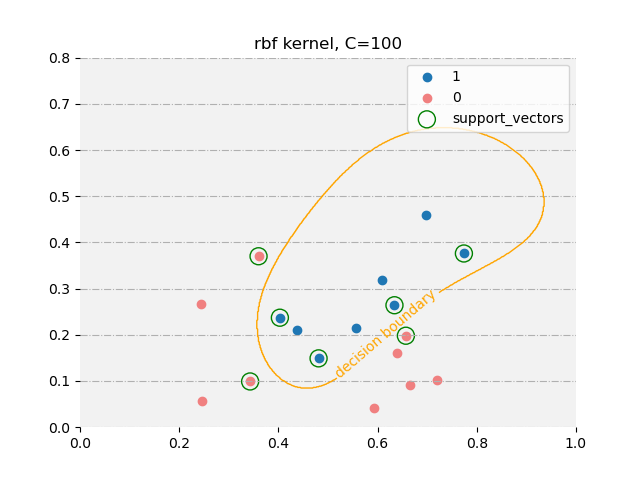

###第六章作业
####课后习题
*6.1 试证明样本空间中任意点$x$到超平面$(w,b)$的的距离为式 (6.2)*


*6.2 试使用 LIBSVM，在西瓜数据集 3.0α 上分别用线性核和高斯核训练一个 SVM，并比较其支持向量的差别*
**惩罚因子大的时候，线性核SVM比高斯核SVM的支持向量多**
|  C  |      SVM      |  num_supportVec |
|----------|:-------------:|------:|
| 1 |  linear | 16 |
| 1 |    rbf   |   17 |
| 100 | linear |    13 |
| 100 | rbf |    7 |
代码：
```
from sklearn import svm
import pandas as pd
from matplotlib import pyplot as plt
import numpy as np

dataPath = r'D:\\vscode\\Markdown\\ML\watermelon3.0α.txt'
data = pd.read_table(dataPath, delimiter=' ', dtype = float)

X = data.iloc[:, [0, 1]].values
y = data.iloc[:, 2].values
# print(X)
# print(y)

y[y == 0] = -1
# print(y)

# 画图函数
def set_ax_gray(ax):
    ax.patch.set_facecolor("gray")
    ax.patch.set_alpha(0.1)
    ax.spines['right'].set_color('none')  # 设置隐藏坐标轴
    ax.spines['top'].set_color('none')
    ax.spines['bottom'].set_color('none')
    ax.spines['left'].set_color('none')
    ax.grid(axis='y', linestyle='-.')


def plt_support_(clf, X_, y_, kernel, c):
    pos = y_ == 1
    neg = y_ == -1
    ax = plt.subplot()

    x_tmp = np.linspace(0, 1, 600)
    y_tmp = np.linspace(0, 0.8, 600)

    X_tmp, Y_tmp = np.meshgrid(x_tmp, y_tmp)

    Z_rbf = clf.predict(np.c_[X_tmp.ravel(), Y_tmp.ravel()]).reshape(X_tmp.shape)

    # ax.contourf(X_, Y_, Z_rbf, alpha=0.75)
    cs = ax.contour(X_tmp, Y_tmp, Z_rbf, [0], colors='orange', linewidths=1)
    ax.clabel(cs, fmt={cs.levels[0]: 'decision boundary'})

    set_ax_gray(ax)

    ax.scatter(X_[pos, 0], X_[pos, 1], label='1', color='C0')
    ax.scatter(X_[neg, 0], X_[neg, 1], label='0', color='lightcoral')

    ax.scatter(X_[clf.support_, 0], X_[clf.support_, 1], marker='o', c='none', edgecolors='g', s=150,
               label='support_vectors')

    ax.legend()
    ax.set_title('{} kernel, C={}'.format(kernel, c))
    plt.show()

# C = 1，kernel='linear': 线性核函数
clf_linear = svm.SVC(C=1, kernel='linear')
clf_linear.fit(X, y.astype(int))
print('线性核SVM：')
# print('预测值：', clf_linear.predict(X))
# print('真实值：', y.astype(int))
print('支持向量索引值：', len(clf_linear.support_))

# C = 1，kernel='rbf': 高斯核函数
clf_rbf = svm.SVC(C=1, kernel='rbf', degree=3, gamma='scale')
clf_rbf.fit(X, y.astype(int))
print('高斯核SVM：')
# print('预测值：', clf_rbf.predict(X))
# print('真实值：', y.astype(int))
print('支持向量数目：', len(clf_rbf.support_))

# C = 100：经验误差小，kernel='linear': 线性核函数
clf_linear = svm.SVC(C=100, kernel='linear')
clf_linear.fit(X, y.astype(int))
print('线性核SVM：')
# print('预测值：', clf_linear.predict(X))
# print('真实值：', y.astype(int))
print('支持向量索引值：', len(clf_linear.support_))

# C = 100：经验误差小，kernel='rbf': 高斯核函数
clf_rbf = svm.SVC(C=100, kernel='rbf', degree=3, gamma='scale')
clf_rbf.fit(X, y.astype(int))
print('高斯核SVM：')
# print('预测值：', clf_rbf.predict(X))
# print('真实值：', y.astype(int))
print('支持向量索引值：', len(clf_rbf.support_))

C = 100
plt_support_(clf_rbf, X, y, 'rbf', C)
plt_support_(clf_linear, X, y, 'linear', C)
```
结果如下：



*6.3 选择两个 UCI 数据集，分别用线性核和高斯核训练一个 SVM，并与BP 神经网络和 C4.5 决策树进行实验比较*
选择sklearn中的iris数据
线性核SVM的正确率: 98.0%
高斯核SVM的正确率: 96.7%
BP神经网络的正确率: 86.7%
决策树的正确率: 95.3%
**线性核SVM、高斯核SVM、决策树，使用sklearn函数**
```
import numpy as np
import pandas as pd

from sklearn import datasets
from sklearn.model_selection import KFold, train_test_split, cross_val_score, cross_validate
from sklearn import svm, tree

# 导入数据
iris = datasets.load_iris()
# print(iris)
# 导入属性值，并标注属性名
X = pd.DataFrame(iris['data'], columns=iris['feature_names'])
# print(X.head())
# 导入标签
y = pd.Series(iris['target_names'][iris['target']])
# print(y.head())

# 线性核SVM的正确率
linear_svm = svm.SVC(C=1, kernel='linear')
linear_scores = cross_validate(linear_svm, X, y, cv=5, scoring='accuracy')
print('线性核SVM的正确率:', linear_scores['test_score'].mean())

# 高斯核SVM的正确率
rbf_svm = svm.SVC(C=1)
rbf_scores = cross_validate(rbf_svm, X, y, cv=5, scoring='accuracy')
print('高斯核SVM的正确率:', rbf_scores['test_score'].mean())

# 决策树正确率
clf = tree.DecisionTreeClassifier(random_state=42)

# 训练
clf.fit(X, y)

# 计算正确率
tree_scores = cross_validate(clf, X, y, cv=5, scoring='accuracy')
print('决策树的正确率:', tree_scores['test_score'].mean())
```
**BP神经网络，使用pytorch搭建**
```
import torch
import torch.nn as nn
import torch.optim as optim
from sklearn.datasets import load_iris
from sklearn.model_selection import train_test_split
from sklearn.preprocessing import StandardScaler

# Load the iris dataset
iris = load_iris()

# Split the dataset into training and testing sets
X_train, X_test, y_train, y_test = train_test_split(iris.data, iris.target, test_size=0.2)

# Standardize the data
scaler = StandardScaler()
X_train = scaler.fit_transform(X_train)
X_test = scaler.transform(X_test)

# Convert the data to PyTorch tensors
X_train = torch.from_numpy(X_train).float()
X_test = torch.from_numpy(X_test).float()
y_train = torch.from_numpy(y_train).long()
y_test = torch.from_numpy(y_test).long()

# Define the neural network architecture
class Net(nn.Module):
    def __init__(self):
        super(Net, self).__init__()
        self.fc1 = nn.Linear(4, 10)
        self.fc2 = nn.Linear(10, 3)

    def forward(self, x):
        x = torch.relu(self.fc1(x))
        x = self.fc2(x)
        return x

# Create an instance of the neural network
net = Net()

# Define the loss function and optimizer
criterion = nn.CrossEntropyLoss()
optimizer = optim.SGD(net.parameters(), lr=0.01)

# Train the neural network
for epoch in range(1000):
    optimizer.zero_grad()
    output = net(X_train)
    loss = criterion(output, y_train)
    loss.backward()
    optimizer.step()
    if epoch % 100 == 0:
        print('Epoch {}, Loss: {:.4f}'.format(epoch, loss.item()))

# Test the neural network
with torch.no_grad():
    output = net(X_test)
    _, predicted = torch.max(output, 1)
    accuracy = (predicted == y_test).sum().item() / y_test.size(0)
    print('Test Accuracy: {:.2f}%'.format(accuracy * 100))
```

*6.5 试述高斯核 SVM 与 RBF 神经网络之间的联系*
课本注释：若将隐藏层神经元个数设置为训练样本数，且每个样本设置为一个神经元中心，则以高斯径向基函数为激活函数的RBF网络恰与高斯核SVM的预测函数相同
高斯核 SVM 与 RBF 神经网络**都以高斯函数加权作为预测值**，所以经验误差相似，训练结果类似

*6.6 试析 SVM 对噪声敏感的原因*
噪声的出现可能**导致**线性可分的数据变得**近似线性可分或者线性不可分**
使用软间隔和核函数就**需要**在结构简单和经验误差做**折衷**

###附加题
*函数复杂度*
**函数复杂度仅仅是一种描述函数计算时间和空间资源消耗的量度**
例如：
多项式函数的复杂度与其次数 $n$ 有关，通常用 $O(n)$ 表示
指数函数和对数函数的复杂度通常是 $O(1)$，也就是说它们的计算时间与函数参数的取值无关
三角函数的计算复杂度通常与使用的算法和精度有关。例如，使用泰勒级数计算三角函数的值时，计算复杂度为 $O(n)$，其中 $n$ 是级数的项数。而使用 Cordic 算法计算三角函数的值时，计算复杂度为 $O(\log n)$，其中 $n$ 是计算的精度