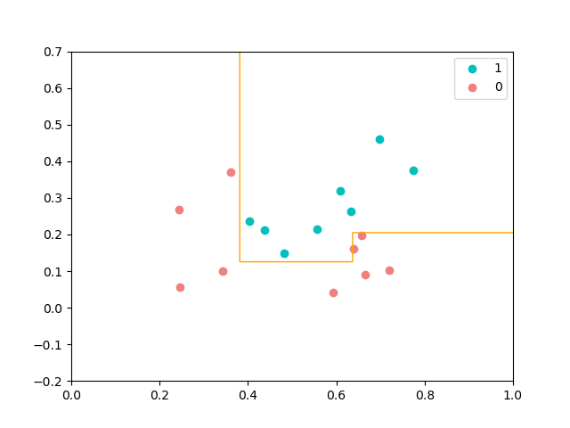
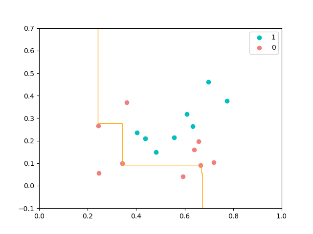

###第八章作业
####课后习题

*8.1 知Hoeffding不等式，试推导8.3*
$P(F(x) \neq f(x)) = \sum _{k = 0} ^ \frac{T}{2} C_T^k(1 - \epsilon)^k \epsilon^{T-k}$
即$P(H(T) \leq \frac{T}{2}) = \sum _{k = 0} ^ \frac{T}{2} C_T^k(1 - \epsilon)^k \epsilon^{T-k}$
$\frac{T}{2} = ((1 - \epsilon) - \delta) T$
$\delta = \frac{1 - 2 \epsilon}{2}$
由Hoeffding不等式，得$P(H(T) \leq \frac{T}{2}) \leq e ^ {-2 \delta ^ 2 T} = e ^ {\frac{-T(1 - 2 \delta) ^ 2}{2}}$

*8.3 从网上下载或自己编程实现 AdaBoost，以不剪枝抉策树为基学习器，在西瓜数据集 3.0α 上训练一个 AdaBoost 集成，并与图 8.4进行比较*
AdaBoost程序
```
import numpy as np
import pandas as pd
from matplotlib import pyplot as plt


class Node(object):
    def __init__(self):
        self.feature_index = None
        self.split_point = None
        self.deep = None
        self.left_tree = None
        self.right_tree = None
        self.leaf_class = None


def gini(y, D):
    '''
    计算样本集y下的加权基尼指数
    :param y: 数据样本标签
    :param D: 样本权重
    :return:  加权后的基尼指数
    '''
    unique_class = np.unique(y)
    total_weight = np.sum(D)

    gini = 1
    for c in unique_class:
        gini -= (np.sum(D[y == c]) / total_weight) ** 2

    return gini


def calcMinGiniIndex(a, y, D):
    '''
    计算特征a下样本集y的的基尼指数
    :param a: 单一特征值
    :param y: 数据样本标签
    :param D: 样本权重
    :return:
    '''

    feature = np.sort(a)
    total_weight = np.sum(D)

    split_points = [(feature[i] + feature[i + 1]) / 2 for i in range(feature.shape[0] - 1)]

    min_gini = float('inf')
    min_gini_point = None

    for i in split_points:
        yv1 = y[a <= i]
        yv2 = y[a > i]

        Dv1 = D[a <= i]
        Dv2 = D[a > i]
        gini_tmp = (np.sum(Dv1) * gini(yv1, Dv1) + np.sum(Dv2) * gini(yv2, Dv2)) / total_weight

        if gini_tmp < min_gini:
            min_gini = gini_tmp
            min_gini_point = i

    return min_gini, min_gini_point


def chooseFeatureToSplit(X, y, D):
    '''
    :param X:
    :param y:
    :param D:
    :return: 特征索引, 分割点
    '''
    gini0, split_point0 = calcMinGiniIndex(X[:, 0], y, D)
    gini1, split_point1 = calcMinGiniIndex(X[:, 1], y, D)

    if gini0 > gini1:
        return 1, split_point1
    else:
        return 0, split_point0


def createSingleTree(X, y, D, deep=0):
    '''
    这里以C4.5 作为基学习器，限定深度为2，使用基尼指数作为划分点，基尼指数的计算会基于样本权重，
    不确定这样的做法是否正确，但在西瓜书p87, 4.4节中, 处理缺失值时, 其计算信息增益的方式是将样本权重考虑在内的，
    这里就参考处理缺失值时的方法。
    :param X: 训练集特征
    :param y: 训练集标签
    :param D: 训练样本权重
    :param deep: 树的深度
    :return:
    '''

    node = Node()
    node.deep = deep

    if (deep == 2) | (X.shape[0] <= 2):  # 当前分支下，样本数量小于等于2 或者 深度达到2时，直接设置为也节点
        pos_weight = np.sum(D[y == 1])
        neg_weight = np.sum(D[y == -1])
        if pos_weight > neg_weight:
            node.leaf_class = 1
        else:
            node.leaf_class = -1

        return node

    feature_index, split_point = chooseFeatureToSplit(X, y, D)

    node.feature_index = feature_index
    node.split_point = split_point

    left = X[:, feature_index] <= split_point
    right = X[:, feature_index] > split_point

    node.left_tree = createSingleTree(X[left, :], y[left], D[left], deep + 1)
    node.right_tree = createSingleTree(X[right, :], y[right], D[right], deep + 1)

    return node


def predictSingle(tree, x):
    '''
    基于基学习器，预测单个样本
    :param tree:
    :param x:
    :return:
    '''
    if tree.leaf_class is not None:
        return tree.leaf_class

    if x[tree.feature_index] > tree.split_point:
        return predictSingle(tree.right_tree, x)
    else:
        return predictSingle(tree.left_tree, x)


def predictBase(tree, X):
    '''
    基于基学习器预测所有样本
    :param tree:
    :param X:
    :return:
    '''
    result = []

    for i in range(X.shape[0]):
        result.append(predictSingle(tree, X[i, :]))

    return np.array(result)

### adaBoost算法
def adaBoostTrain(X, y, tree_num=20):
    '''
    以深度为2的决策树作为基学习器，训练adaBoost
    :param X:
    :param y:
    :param tree_num:
    :return:
    '''
    # 初始化权重
    D = np.ones(y.shape) / y.shape  
    # 所有基学习器
    trees = []  
    # 基学习器对应权重
    a = []  
    # 集成学习器
    agg_est = np.zeros(y.shape)

    # 训练基学习器
    for _ in range(tree_num):
        # 以当前样本生成学习器
        tree = createSingleTree(X, y, D)
        # 计算错误率
        hx = predictBase(tree, X)
        err_rate = np.sum(D[hx != y])

        if (err_rate > 0.5) | (err_rate == 0):  # 错误率大于0.5 或者 错误率为0时，则直接停止
            break
        
        # 计算本学习器权重
        at = np.log((1 - err_rate) / max(err_rate, 1e-16)) / 2
        # 更新集成学习器
        agg_est += at * hx
        trees.append(tree)
        a.append(at)

        # 更新下一次训练时每个样本权重
        # 按照PPT所示求Z
        err_index = np.ones(y.shape)
        err_index[hx == y] = -1
        D = D * np.exp(err_index * at)
        # 更新样本权重
        D = D / np.sum(D)

    return trees, a, agg_est


def adaBoostPredict(X, trees, a):
    agg_est = np.zeros((X.shape[0],))

    for tree, am in zip(trees, a):
        agg_est += am * predictBase(tree, X)

    result = np.ones((X.shape[0],))

    result[agg_est < 0] = -1

    return result.astype(int)


def pltAdaBoostDecisionBound(X_, y_, trees, a):
    pos = y_ == 1
    neg = y_ == -1
    x_tmp = np.linspace(0, 1, 600)
    y_tmp = np.linspace(-0.2, 0.7, 600)

    X_tmp, Y_tmp = np.meshgrid(x_tmp, y_tmp)

    Z_ = adaBoostPredict(np.c_[X_tmp.ravel(), Y_tmp.ravel()], trees, a).reshape(X_tmp.shape)
    plt.contour(X_tmp, Y_tmp, Z_, [0], colors='orange', linewidths=1)

    plt.scatter(X_[pos, 0], X_[pos, 1], label='1', color='c')
    plt.scatter(X_[neg, 0], X_[neg, 1], label='0', color='lightcoral')
    plt.legend()
    plt.show()


if __name__ == "__main__":
    data_path = r'D:\\vscode\\Markdown\\ML\watermelon3.0α.txt'

    data = pd.read_table(data_path, delimiter=' ')

    X = data.iloc[:, :2].values
    y = data.iloc[:, 2].values

    y[y == 0] = -1

    trees, a, agg_est = adaBoostTrain(X, y)

    print(len(trees))
    pltAdaBoostDecisionBound(X, y, trees, a)
```

**基学习器有3个，全部分对**

*8.5 试编程实现 Bagging，以决策树桩为基学习器，在西瓜数据集 3.0α 上训练一个 Bagging 集戚，井与图 8.6 进行比较*
bagging程序
```
import numpy as np
import pandas as pd
from matplotlib import pyplot as plt
from sklearn.utils import resample


def stumpClassify(X, dim, thresh_val, thresh_inequal):
    
    # 返回的是2D数组
    ret_array = np.ones((X.shape[0], 1))

    if thresh_inequal == 'lt':
        ret_array[X[:, dim] <= thresh_val] = -1
    else:
        ret_array[X[:, dim] > thresh_val] = -1
    
    # print(ret_array)
    return ret_array


def buildStump(X, y):
    m, n = X.shape
    # 决策树桩，只有一个划分属性
    best_stump = {}

    min_error = 1

    # 对每一维都判断是否为最优属性
    for dim in range(n):

        x_min = np.min(X[:, dim])
        x_max = np.max(X[:, dim])
        # 连续型变量的划分点
        split_points = [(x_max - x_min) / 20 * i + x_min for i in range(20)]
        
        # sorted_x = np.sort(X[:, dim])
        # split_points = [(sorted_x[i] + sorted_x[i + 1]) / 2 for i in range(m - 1)]
        
        # 划分点以上为正，还是一下为正
        for inequal in ['lt', 'gt']:
            for thresh_val in split_points:

                # 计算错误率
                ret_array = stumpClassify(X, dim, thresh_val, inequal)
                error = np.mean(ret_array != y)

                if error < min_error:
                    best_stump['dim'] = dim
                    best_stump['thresh'] = thresh_val
                    best_stump['inequal'] = inequal
                    best_stump['error'] = error
                    min_error = error
    
    # print(best_stump)
    return best_stump


def stumpBagging(X, y, nums=20):
    stumps = []
    seed = 16
    for _ in range(nums):
        # sklearn 中自带的实现自助采样的方法
        X_, y_ = resample(X, y, random_state=seed)  
        seed += 1
        # 添加基学习器
        stumps.append(buildStump(X_, y_))
    
    return stumps


def stumpPredict(X, stumps):
    ret_arrays = np.ones((X.shape[0], len(stumps)))

    for i, stump in enumerate(stumps):
        # 因为stumpClassify返回的是2D数组，所以用ret_arrays[:, [i]]
        # ret_arrays[:, i]返回的是1D数组
        ret_arrays[:, [i]] = stumpClassify(X, stump['dim'], stump['thresh'], stump['inequal'])

    return np.sign(np.sum(ret_arrays, axis=1))


def pltStumpBaggingDecisionBound(X_, y_, stumps):
    pos = y_ == 1
    neg = y_ == -1
    x_tmp = np.linspace(0, 1, 600)
    y_tmp = np.linspace(-0.1, 0.7, 600)

    X_tmp, Y_tmp = np.meshgrid(x_tmp, y_tmp)
    Z_ = stumpPredict(np.c_[X_tmp.ravel(), Y_tmp.ravel()], stumps).reshape(X_tmp.shape)

    plt.contour(X_tmp, Y_tmp, Z_, [0], colors='orange', linewidths=1)

    plt.scatter(X_[pos, 0], X_[pos, 1], label='1', color='c')
    plt.scatter(X_[neg, 0], X_[neg, 1], label='0', color='lightcoral')
    plt.legend()
    plt.show()


if __name__ == "__main__":
    data_path = r'D:\\vscode\\Markdown\\ML\watermelon3.0α.txt'

    data = pd.read_table(data_path, delimiter=' ')

    X = data.iloc[:, :2].values
    y = data.iloc[:, 2].values

    y[y == 0] = -1

    stumps = stumpBagging(X, y, 21)

    print(np.mean(stumpPredict(X, stumps) == y))
    pltStumpBaggingDecisionBound(X, y, stumps)
```

**基学习器21个，正确率为76.47%，和最优分类结果差异较大**

*8.7 试析随机森林为何比决策树 Bagging 集成的训练速度更快*
**Bagging在选择划分属性是，对节点的所有属性进行考察，而随机森林只需考察一个属性子集**
决策树的生成过程中，最耗时的就是搜寻最优切分属性；因而随机森林比普通决策树Bagging训练速度要快。

####思考题
*0、1即二进制是谁先提出的*
莱布尼茨是二进制系统的发明者之一，他于17世纪提出了一种使用0和1表示数字的计算系统。莱布尼茨的二元论被广泛认为是二进制系统的先驱，但是他并没有将其应用于计算机科学中。
20世纪早期，德国数学家克劳德·香农（Claude Shannon）在他的博士论文中首次引入了二进制数字作为一种有效的数学表达方式。这个论文被认为是现代数字电路和计算机科学的基础之一。此后，二进制数字在计算机科学中得到了广泛的应用，成为了计算机内部数据存储和处理的基础。
因此，是**香农先提出二进制数字在计算机科学中应用**
*怎么理解 P 问题和 NP 问题*
P就是能在多项式时间内解决的问题，NP就是能在多项式时间验证答案正确与否的问题。用大白话讲大概就是这样。所以P是否等于NP实质上就是在问，如果对于一个问题我**能在多项式时间内验证其答案的正确性，那么我是否能在多项式时间内解决它?**