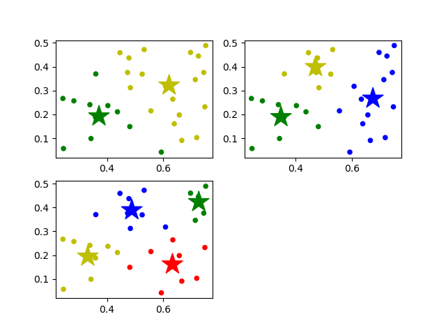

###第九章作业
####课后习题
*9.1 试证明 : p >= 1 时，闵可夫斯基距离满足距离度量的四条基本性质；0 <= p < 1 时，闵可夫斯基距离不满足直递性，但满足非负性、同一性、对称性；P 趋向无穷大时，闵可夫斯基距离等于对应分量的最大绝对距离*
$\because |X_{iu} - X_{ju}| \ge 0$
$\therefore$ 非负性、同一性和对称性易得
$dist(X_i, X_j) = (\sum_{u = 1}^n|X_{iu} - X_{ju}|^p)^{\frac{1}{p}} = (\sum_{u = 1}^n|(X_{iu} - X_{ku}) + (X_{ku} - X_{ju})|^p)^{\frac{1}{p}}$
$dist(X_i, X_k) + dist(X_k, X_j) = (\sum_{u = 1}^n|(X_{iu} - X_{ku})|^p)^{\frac{1}{p}} + (\sum_{u = 1}^n|(X_{ku} - X_{ju})|^p)^{\frac{1}{p}}$
由闵可夫斯基不等式可知，$p \ge 1$时，$dist(X_i, X_j) = (\sum_{u = 1}^n|(X_{iu} - X_{ku}) + (X_{ku} - X_{ju})|^p)^{\frac{1}{p}} \ge (\sum_{u = 1}^n|(X_{iu} - X_{ku})|^p)^{\frac{1}{p}} + (\sum_{u = 1}^n|(X_{ku} - X_{ju})|^p)^{\frac{1}{p}} = dist(X_i, X_k) + dist(X_k, X_j)$
而$0 \le p < 1$时，则相反
$\lim_{p->+\infty} ((\sum_{u = 1}^n|X_{iu} - X_{ju}|^p)^{\frac{1}{p}}) = max_u|X_{iu} - X_{ju}| \lim_{p->+\infty} ((\sum_{u = 1}^n (\frac{|X_{iu} - X_{ju}|}{max_u|X_{iu} - X_{ju}|})^p)^{\frac{1}{p}})$
$\because 0 < \frac{|X_{iu} - X_{ju}|}{max_u|X_{iu} - X_{ju}|} \le 1$
对于小于1的项，当 $p->+\infty$ 时趋向于0，只有为1的项保留下来了，$p->+\infty$ 时还为1。因为只有有限个等于1的项，所以求和可以认为等于一个常数a，且a $\ge$ 1，则 $\lim_{p->+\infty} a^p = 1$
$\therefore \lim_{p->+\infty} ((\sum_{u = 1}^n|X_{iu} - X_{ju}|^p)^{\frac{1}{p}}) = max_u|X_{iu} - X_{ju}|$

*9.2 同一样本空间中的集合 X 与 Z 之间的距离可通过"豪斯多夫距离" (Hausdorff distance)计算：试证明:豪斯多夫距离满足距离度量的四条基本性质*
非负性：
$\because ||x - z|| \ge 0$
$\therefore dist_H \ge 0$
同一性：
若 $X \neq Z$，不失一般性，假设 $x_i \neq z_i$ ，其他的样本都完全相同，那么对于 $x_j, j = 1,2,...$ 都有 $z_j$ 使得 $min_{z \in Z}||x_j - z||_2 = 0$ ，而对于 $x_i$ ，由于没有相同的样本，所以$min_{z \in Z}||x_i - z||_2 > 0$ $\therefore dist_H > 0$
对称性：
$dist_H(X, Z) = max(dist_h(X, Z), dist_h(Z, X)) = max(dist_h(Z, X), dist_h(X, Z)) = dist_H(Z, X)$

*9.3 试析 k 均值算法能否找到最小化式 (9.24) 的最优解*
**不能**，因为最小化 9.24 式是 NP 问题，且 9.24 是非凸的，k 均值算法容易陷入局部最优，所以在使用 k 均值时常常多次随机初始化中心点，然后挑选结果最好的一个。

*9.4 试编程实现 k 均值算法，设置三组不同的 k 值、三组不同初始中心点，在西瓜数据集 4.0 上进行实验比较，并讨论什么样的初始中心有利于取得好结果*
k均值算法程序
```
import numpy as np
import matplotlib.pyplot as plt
import matplotlib as mpl

# 初始化k个聚类中心点
def KMeansInitCentroids(X, k):
    # 随机选择k个聚类中心的索引
    kCentroidsIndex = np.random.randint(0, X.shape[0], size = k)
    # 返回k个聚类中心
    return X[kCentroidsIndex]

def findClosestCentroids(X, centroids):
    cluster = np.zeros(len(X)) #用于存储每个样本所属的聚类中心
    for i in range(len(X)):
        min_cluster = -1 #最近的聚类中心的编号
        min_dist = float('inf') #最近的距离

        for j in range(len(centroids)):
            dist = np.sum(np.power(X[i] - centroids[j], 2)) #计算样本到聚类中心的距离
            if dist < min_dist:
                min_cluster = j
                min_dist = dist

        cluster[i] = min_cluster #记录样本所属的聚类中心

    return cluster

def computeCentroids(X, cluster):
    k = set(np.ravel(cluster).tolist()) #聚类中心的编号
    k = list(k)

    centroids = np.ndarray((len(k), X.shape[1])) #用于存储每个聚类中心的坐标

    for i in range(len(k)):
        cluster_data = X[np.where(cluster == k[i])[0]] #当前聚类中心所包含的样本
        centroids[i] = np.sum(cluster_data, axis= 0) / len(cluster_data) #计算新的聚类中心坐标

    return centroids

def kMeans(X, num_cluster = 3, max_iters = 20):
    initCentroids = KMeansInitCentroids(X, num_cluster) #初始化聚类中心
    #迭代
    for i in range(max_iters):
        
        if(i == 0):
            centroids = initCentroids
            #print(centroids)
            
        #计算样本到聚类中心的距离，并返回每个样本所属的聚类中心
        cluster = findClosestCentroids(X, centroids)
        #重新计算聚类中心
        centroids = computeCentroids(X, cluster)

        print(f"Iteration {i+1}/{max_iters}: Cluster={cluster}, Centroids={centroids}")

    return cluster, centroids


if __name__ == "__main__":
    X = np.loadtxt('D:\\vscode\Markdown\ML\watermelon4.0.txt', delimiter=',')
    #执行聚类算法，返回聚类结果和聚类中心
    cluster, centroids = kMeans(X, 2, 20)
    #绘图
    plt.subplot(221)
    cm_dark = mpl.colors.ListedColormap(['g', 'r', 'b', 'y'])
    #绘制样本点
    plt.scatter(X[:, 0], X[:, 1], c=np.ravel(cluster), cmap=cm_dark, s=20)
    #绘制中心点
    plt.scatter(centroids[:, 0], centroids[:, 1], c=np.arange(len(centroids)), cmap=cm_dark, marker='*', s=500)

    cluster, centroids = kMeans(X, 3, 20)
    #绘图
    plt.subplot(222)
    cm_dark = mpl.colors.ListedColormap(['g', 'r', 'b', 'y'])
    #绘制样本点
    plt.scatter(X[:, 0], X[:, 1], c=np.ravel(cluster), cmap=cm_dark, s=20)
    #绘制中心点
    plt.scatter(centroids[:, 0], centroids[:, 1], c=np.arange(len(centroids)), cmap=cm_dark, marker='*', s=500)

    cluster, centroids = kMeans(X, 4, 20)
    #绘图
    plt.subplot(223)
    cm_dark = mpl.colors.ListedColormap(['g', 'r', 'b', 'y'])
    #绘制样本点
    plt.scatter(X[:, 0], X[:, 1], c=np.ravel(cluster), cmap=cm_dark, s=20)
    #绘制中心点
    plt.scatter(centroids[:, 0], centroids[:, 1], c=np.arange(len(centroids)), cmap=cm_dark, marker='*', s=500)
    plt.show()
```
三组k均值聚类

初始中心的**数目接近比较适合的簇数**，**位置接近每个簇中心**，这样得到的结果比较好和快。

####思考题
*回归与分类最大的不同和相同之处*
不同：
回归与分类的根本区别在于**输出空间是否为一个度量空间**。对于回归问题，其输出空间B是一个度量空间，是定量的值；对于分类问题，其输出空间B不是度量空间，在分类问题中，只有分类“正确”与“错误”之分
相同：
回归问题与分类问题本质上都是要建立映射关系，都需要大量数据

*范数*
向量范数：
1-范数
$||x||_1 = \sum_{i = 1}^m|x_i|$
2-范数
$||x||_2 = (\sum_{i = 1}^m|x_i|^2)^{\frac{1}{2}}$
$\infty$-范数
$||x||_{\infty} = max_i|x_i|$
矩阵范数:
1-范数
$||A||_1 = max_j \sum_{i=1}^m|a_{i,j}|$
2-范数
$||A||_2 = \sqrt{A^TA}$
$\infty$-范数
$||A||_\infty = max_i \sum_{j=1}^m|a_{i,j}|$
F-范数
$||A||_F = (\sum_{i=1}^m \sum_{j=1}^n a_{i,j}^2)^\frac{1}{2}$